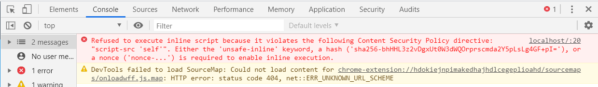

# XSS Test Site

**https://xss-test-site-with-csp.azurewebsites.net/**

This is a copy of the site hosted at **https://xss-test-site.azurewebsites.net/** with one main difference, it includes a `Content-Security-Policy` header.

By including this header XSS attacks are blocked and the site is not vulnerable to the same problem as the original site.

If you attempt to use XSS on this site you should see the following message in the Chrome Dev Tools:

### Original site source code:

https://github.com/gavynriebau/xss-test-site
